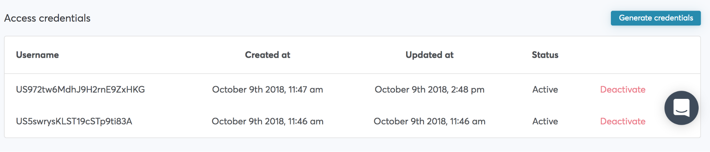

# Example Content Page 1

<Note
    message="Note"
    type="warning"
    description="This is example of doc 1"
/>

Some content for example 1 document

## Subheader content 1

some content



## Subheader content 2

some content


some code example

``` swift
    /// On user did finish picking file
    @objc func userDidPickFileWithInfo(_ info: VGSFileInfo)

    /// On user did Cancel file picking
    @objc func userDidSCancelFilePicking()

    /// On error occured during file picking
    @objc optional func filePickingFailedWithError(_ error: VGSError)
```
